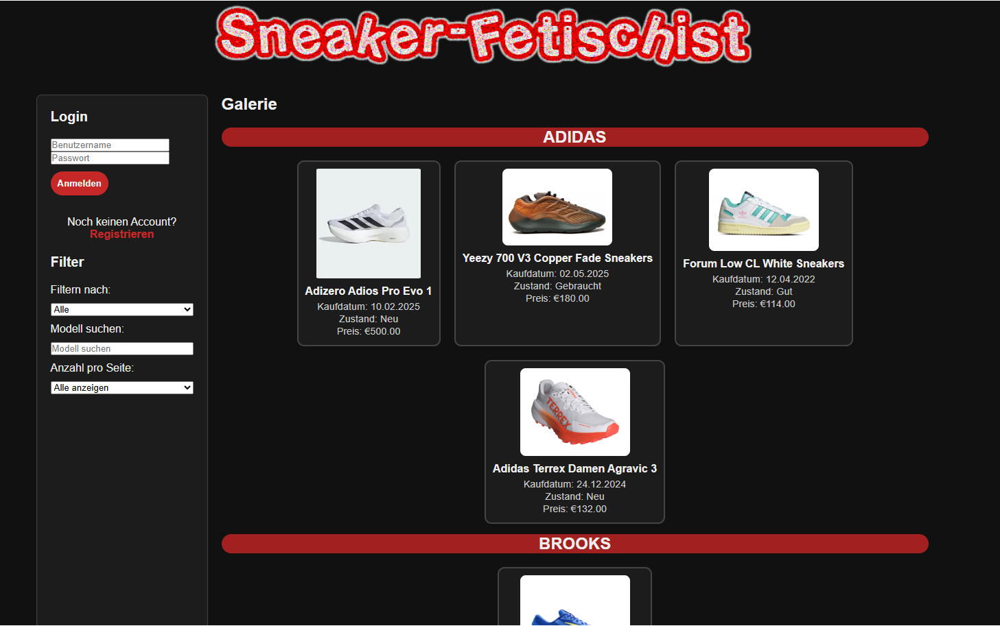
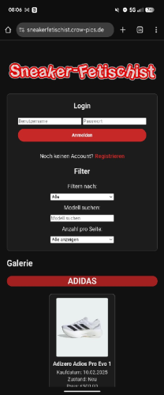

# Sneaker-Fetischist – Web-App (Frontend)

**Live-Demo:** https://sneakerfetischist.crow-pics.de  
Webanwendung zur Darstellung und Verwaltung einer Sneaker-Sammlung mit Login/Registrierung, Filter- und Suchfunktionen sowie Marken-Galerien.

## Features (Frontend)
- **Login & Registrierung** (Formulare, Validierung auf Client-/Server-Seite)
- **Filter & Suche:** nach Marke, Modellsuche, Sortierung nach Preis, Auswahl „Anzahl pro Seite“
- **Galerie-Ansicht** mit Karten (Bild, Kaufdatum, Zustand, Preis), nach Marken gruppiert
- **Feedback-Meldungen** (z. B. Erfolgshinweise nach Aktionen)
- **Responsives Layout** (HTML5/CSS3), strukturierte Semantik und wiederverwendbare Komponenten

## Meine Rolle
- Hauptverantwortlich für das **Frontend (HTML, CSS, JavaScript)**
- **Integration/Zusammenführung** der Teilbereiche
- **Bugfixes** in bestehenden **PHP-/SQL**-Teilen (kleinere Korrekturen/Anpassungen)

## Testzugang
- Benutzername: `testuser`  
- Passwort: `test123`  

Mit diesem Zugang können Login, Sneaker-Einfügen und Filterfunktionen ausprobiert werden.

## Technologien
- HTML5, CSS3, JavaScript
- PHP & SQL (nur für Bugfixes/Integration)

## Funktionsweise (Frontend)
Die Oberfläche stellt die Sneaker in einer markenbasierten Galerie dar. Filter-/Suchoptionen (Marke, Modell, Preis-Sortierung, Anzahl pro Seite) steuern die Darstellung. Formulare für Login/Registrierung binden serverseitige Logik ein; das Frontend übernimmt Struktur, Styles, Interaktionen und nutzerfreundliche Rückmeldungen.

## Nutzung
- **Live ansehen:** siehe Link oben.
- **Lokal (optional):** Projekt in eine lokale PHP-Umgebung legen (z. B. XAMPP/LAMP), `index.php` im Browser öffnen.

## Screenshots

  
  

## Hinweis
Da es sich um ein Gruppenprojekt handelt, sind nicht alle Bestandteile von mir erstellt. Mein Schwerpunkt lag auf dem **Frontend (HTML, CSS, JavaScript)** sowie der **Integration** und dem **Bugfixing in vorhandenen PHP-/SQL-Komponenten**.
