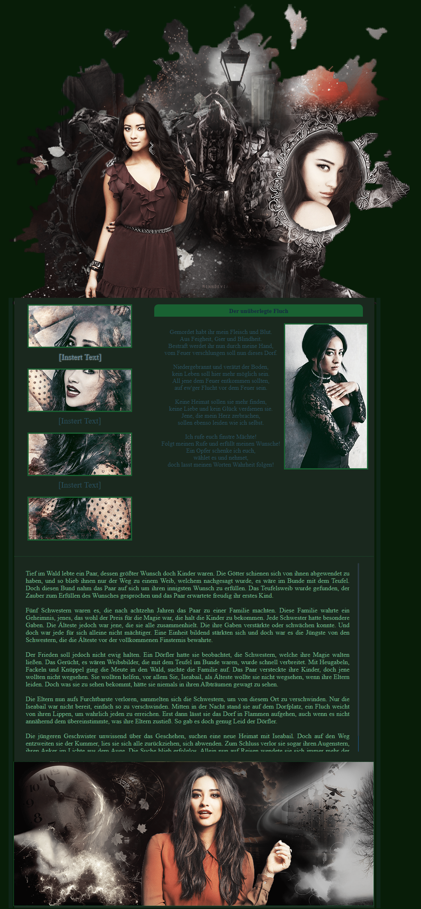

# Biografie-Webseite – Person D1

Dieses Projekt zeigt eine einfache Biografie-Webseite, die mit **HTML**, **CSS** und **Javascript** umgesetzt wurde.  
Im Mittelpunkt steht die klare Strukturierung von Text und imagesn.

## Technologien
- HTML5
- CSS3
- Javascript

## Features
- Nutzung von CSS für Layout und Typografie
- Eingebundene images im Unterordner `/images`
- Responsives Grundlayout (Seite passt sich der Fenstergröße an)

## Vorschau

## Nutzung
Die Webseite kann durch Öffnen der Datei `index.html` im Browser angezeigt werden.
